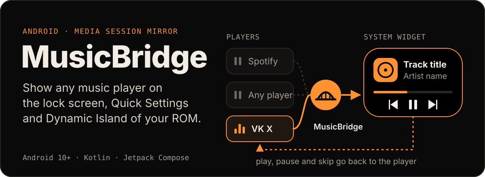
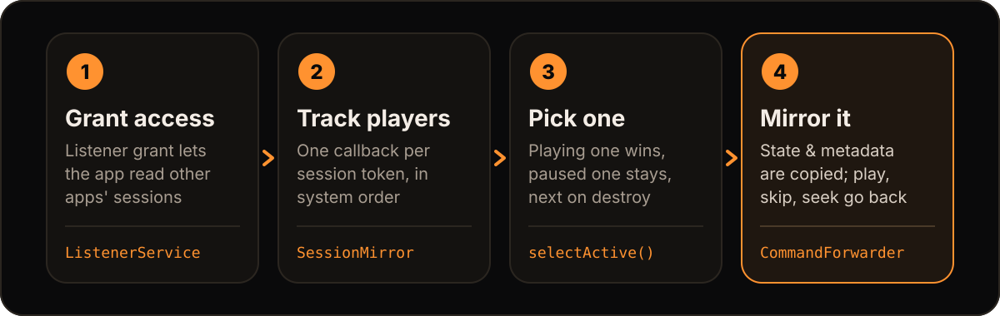

<p align="center">
  
</p>

<div align="center">
  <h1>MusicBridge</h1>
  <a href="#install-and-set-up"><b>Install</b></a> ·
  <a href="#how-it-works"><b>How it works</b></a> ·
  <a href="#integrating-with-other-apps"><b>Integrating</b></a> ·
  <a href="#flavors"><b>Flavors</b></a> ·
  <a href="#build-from-source"><b>Build</b></a>
</div>

<br>

MusicBridge mirrors the active media session of any music player (Spotify, VK X, …) into its own
`MediaSession`, published under a package name that OEM ROMs whitelist. The lock screen, the Quick
Settings media widget and the Dynamic Island then show the player you are actually using, and
every transport command (play, pause, skip, seek, …) is forwarded back to it.

> [!WARNING]
> **Compatibility.** vivo has additional built-in checks that currently limit MusicBridge, so it may not work
> there. Other BBK phones (Oppo, OnePlus, realme) should work fine. It makes no sense on a Pixel or any other
> pure Android ROM.

## How it works

<p align="center">
  
</p>

1. **Grant access.** `MusicBridgeListenerService` is an intentionally empty `NotificationListenerService`.
   Holding its grant is what lets the app call `MediaSessionManager.getActiveSessions`.
2. **Track players.** `SessionMirror` follows the active sessions of other apps, one callback per session token,
   in system priority order.
3. **Pick one.** `selectActive` decides what to mirror: a playing player wins, a paused one stays so the
   widget keeps its controls, and when the mirrored session is destroyed the next playing one takes over.
4. **Mirror and forward.** Metadata, playback state, queue and extras are copied to the `MusicBridge-Mirror`
   session; `CommandForwarder` sends every command it receives back to the mirrored player.

`MusicBridgeService` is a foreground (`mediaPlayback`) service that runs `SessionMirror`. Its notification shows
the current player (`Mirroring: <app>`) and a **Stop** action. `MusicBridgeServiceState` exposes `isRunning`,
`activePackage` and a `MirrorEvent` flow (active player, metadata, playback state) to in-process consumers.

## ListenBrainz and Maloja scrobbling

Open the **Scrobbling** tab, get your user token from [ListenBrainz settings](https://listenbrainz.org/settings/),
and connect your account. Connecting enables scrobbling; it is off by default.

For **Maloja**, set **API server URL** to `https://your-server/apis/listenbrainz`
(include any reverse-proxy path prefix) and enter a Maloja **API key** instead of a ListenBrainz user token.
Connect using Maloja's ListenBrainz-compatible URL, not `/apis/mlj_1`. The `/1` suffix is added automatically;
URLs that already end in `/1` also work. Other ListenBrainz-compatible servers can be used the same way.

If your player shows artists as `Artist 1, Artist 2`, enable **Split artists at commas** after connecting Maloja.
New listens are then sent to the same server's native `/apis/mlj_1/newscrobble` endpoint with an explicit artist array;
the API key is added only when sending, never stored in the queue. The host, port and reverse-proxy prefix stay the same.
This option is off by default and available for `/apis/listenbrainz` (or `/apis/lbrnz`) connections only.
It does not change queued or previously submitted listens. Turn it off when a comma belongs to one artist's name,
such as `Earth, Wind & Fire`. Native submissions skip Maloja's metadata cleanup to preserve the explicit artist names.

HTTPS is the default. For an HTTP-only server, explicitly enable **Allow unencrypted HTTP** before connecting:
the key and listening data will be sent without encryption. Redirects are not followed; enter the final API URL.
The address is saved only after successful key validation, and editing the field alone does not change the connected server.

- Only the currently mirrored player is tracked. Tracks need a title and artist; no `playing_now` updates are sent.
- The default threshold is **30 seconds**. You can set a fixed threshold or use **half the track / 4 minutes,
  whichever is shorter** (4 minutes if the duration is unknown). Pauses, buffering and seeks do not add listening time.
- Qualified listens are queued with WorkManager and survive app restarts. Offline delivery, temporary server errors
  and rate limits are retried. If a token is rejected, reconnect the same account to resume delivery.
- Turning off scrobbling, disconnecting or switching servers/accounts discards the old queue. Reconnecting the same
  server and account preserves it; old listens are never redirected to a new server.
- Tokens are encrypted using Android Keystore and are not included in queued tasks. App data is excluded from backups.

Only playback observed while the service is running counts. Partial listens are not restored after a service restart;
already queued listens can still be sent while the mirroring service is stopped.

## Integrating with other apps

To work with MusicBridge, your music player only needs an active `MediaSession`
(`android.media.session`, `MediaSessionCompat` or Media3 all work).
Supporting `MediaBrowserService` is not required.

For the best result:

- publish `MediaMetadata` (title, artist, album, artwork, duration);
- keep `PlaybackState` up to date and declare the actions you support
  (play, pause, skip, seek), because MusicBridge forwards these commands to your session.

## Flavors

Each flavor is the same app under a different application ID. Install the one whose package your ROM whitelists.

| Flavor      | Application ID           | Stands in for       |
| ----------- | ------------------------ | ------------------- |
| `asNetease` | `com.netease.cloudmusic` | NetEase Cloud Music |
| `asViper`   | `com.kugou.viper`        | KuGou Viper         |
| `asQQ`      | `com.tencent.qqmusic`    | QQ Music            |
| `asLuna`    | `com.luna.music`         | Luna Music          |
| `asHiby`    | `com.hiby.music`         | Hiby Music          |

All flavors share `versionName` `1.0` and the code namespace `app.toil.musicbridge`. Android allows one app per
package name, so a flavor cannot be installed next to the real app it uses the ID of.

## Install and set up

1. Build the APK of your flavor ([Build from source](#build-from-source)) and install it.
2. Open MusicBridge and follow the onboarding. Grant the permissions below.
3. Play something. Opening the app starts the service whenever notification access is granted; the
   **Settings** tab shows its state and starts it again after a Stop. The mirroring service does not autostart on boot.

| Permission                   | Needed   | Why                                               |
| ---------------------------- | -------- | ------------------------------------------------- |
| Notification listener access | Required | Lets Android hand over other apps' media sessions |
| Notifications (Android 13+)  | Optional | Shows the service status and the **Stop** button  |
| Unrestricted battery use     | Optional | Keeps the service alive for longer                |

### ColorOS background activity

On ColorOS, enable **Allow background activity** for MusicBridge in
**Settings → Apps → MusicBridge → Battery usage**. Battery optimization exemption alone may not prevent
the system from freezing the app and hiding the Dynamic Island.

### "Restricted settings" on Android 13+

An APK installed from a browser, file manager or messenger is subject to _Restricted settings_: granting
notification access shows "For your security, this setting is currently unavailable". Installs through an
app store are not affected. To lift the restriction:

1. Try to enable notification access once (on Android 15+ the menu item in step 3 only appears after this attempt).
2. Open **Settings → Apps → MusicBridge**.
3. Tap the ⋮ menu in the top-right corner → **Allow restricted settings** → confirm with PIN or biometrics.
4. Enable notification access again.

### Reinstalling and upgrading

- A build signed with a different key cannot update the installed one: **uninstall the old version first, then
  grant notification access to the new one.** The original 1.0 release key may be lost.
- **Coming from Omnibridge:** the listener service class was renamed to `MusicBridgeListenerService`, so Android
  treats it as a new listener. Re-grant notification access after installing.

## Build from source

Requirements: JDK 17 and the Android SDK (platform 36). Set the SDK path in `local.properties`
(`sdk.dir=...`) or via `ANDROID_HOME`. Use `./gradlew` on Linux and macOS.

```text
gradlew.bat assembleAsNeteaseRelease
gradlew.bat assembleRelease
gradlew.bat testAsNeteaseDebugUnitTest
```

The first builds one flavor, the second builds all five. APKs land in
`app/build/outputs/apk/<flavor>/release/`, for example `asNetease/release/app-asNetease-release.apk`.
